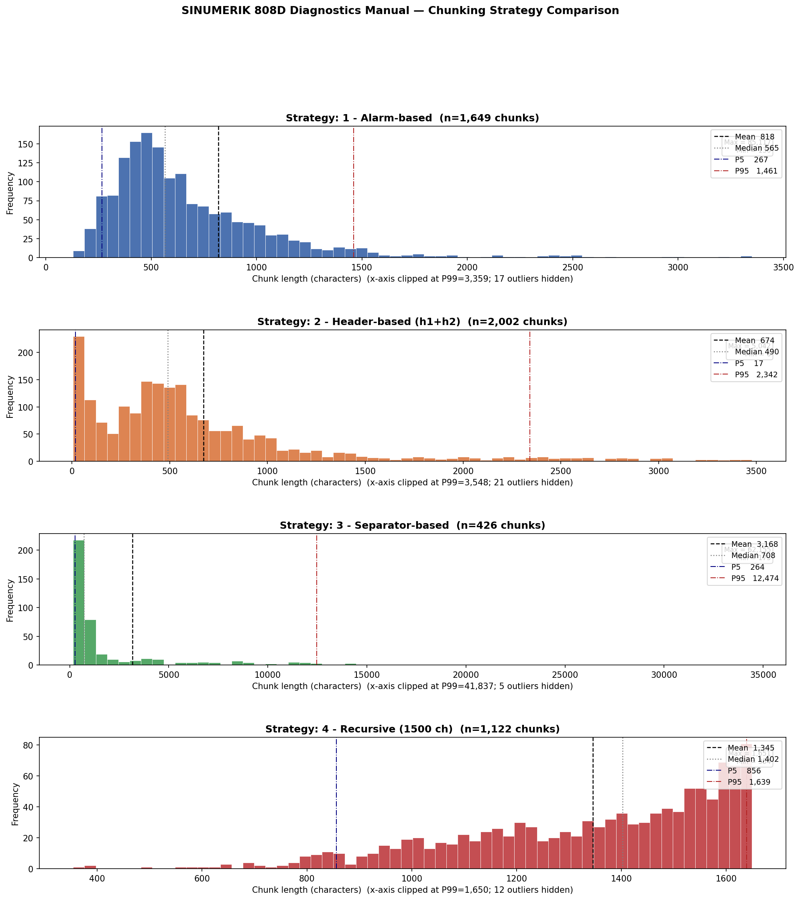
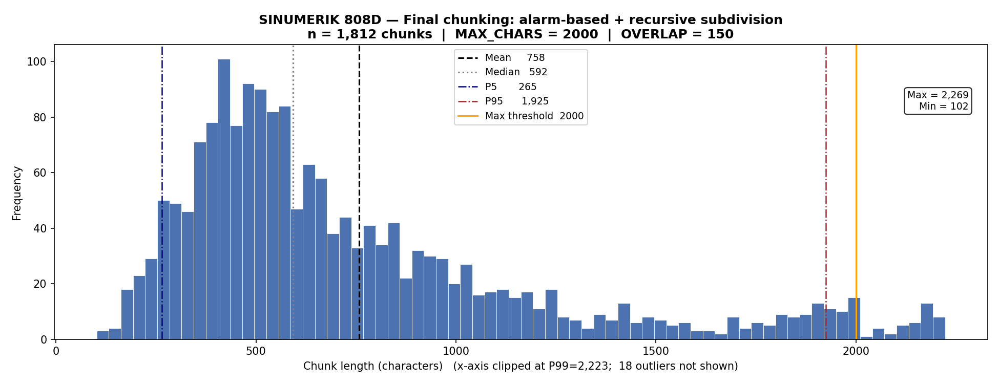

# Chunking

Este documento describe la estrategia de chunking activa de la PoC y resume el
analisis exploratorio que llevo a seleccionarla. El objetivo es que la base de
Weaviate pueda reconstruirse de forma identica en cualquier equipo.

## Fuente documental

La entrada documental es:

```text
data/manuals/808D_ADV_diagnostics_man_0718_en-US.md
```

Es el Markdown estructurado del manual Siemens SINUMERIK 808D ADVANCED
Diagnostics. El documento contiene entradas de alarma con una estructura
recurrente:

```text
# <numero> <titulo de alarma>

**Parameters:** ...
**Explanation:** ...
**Reaction:** ...
**Remedy:** ...
**Programm continuation:** ...
```

El formato no es completamente homogeneo: algunas alarmas aparecen como
encabezados Markdown `#`, `##` o `###`, y otras como numeros en negrita en la
seccion PLC. Tambien aparecen tablas HTML, imagenes referenciadas por
LlamaParse y separadores heredados del parseo del PDF.

## Analisis de estrategias

Antes de fijar la estrategia final se compararon cuatro aproximaciones:

| Estrategia | Descripcion | Problema principal |
|---|---|---|
| Alarm-based | Un chunk por entrada de alarma. | Algunas alarmas largas necesitan subdivision. |
| Header-based | Split por encabezados Markdown `#` y `##`. | Produce encabezados huerfanos y chunks inutiles. |
| Separator-based | Split por separadores `---` y `***`. | Los separadores no aparecen de forma uniforme. |
| Recursive | Split recursivo por caracteres. | Es estable en tamano, pero ciego a la semantica de alarma. |



Resultados del analisis exploratorio:

| Metrica | Alarm-based | Header-based | Separator-based | Recursive |
|---|---:|---:|---:|---:|
| Numero de chunks | 1,649 | 2,002 | 426 | 1,122 |
| Media de caracteres | 818 | 674 | 3,168 | 1,345 |
| Mediana | 565 | 490 | 708 | 1,402 |
| Minimo | 130 | 6 | 173 | 354 |
| Maximo | 85,117 | 5,042 | 62,155 | 1,651 |
| P5 | 267 | 17 | 264 | 856 |
| P95 | 1,461 | 2,342 | 12,474 | 1,639 |

La conclusion fue que la alarma individual es la unidad semantica natural para
este manual. Separar solo por cabeceras o separadores introduce ruido, mientras
que el split recursivo puro puede cortar una alarma entre campos tecnicos.

## Estrategia actual

La PoC usa `chunk_strategy_2`, implementada en:

```text
rag_system/chunking.py
```

Funcion publica:

```text
chunk_strategy_2
```

Parametros base:

```text
RAG_CHUNK_MAX_CHARS=2500
RAG_CHUNK_OVERLAP_CHARS=150
```

El flujo interno es:

1. Leer el Markdown del manual.
2. Detectar limites de alarma mediante expresiones regulares sobre encabezados
   numericos y numeros en negrita.
3. Separar cada alarma como unidad documental.
4. Si una alarma supera el limite de caracteres, subdividir por campos
   tecnicos: `Parameters`, `Explanation`, `Reaction`, `Remedy` y
   `Programm continuation`.
5. Si un campo sigue siendo demasiado grande, aplicar split recursivo por
   parrafo, linea y palabra.
6. Inyectar el encabezado de alarma en los subchunks de continuacion.
7. Devolver objetos `DocumentChunk` con `chunk_id`, texto, seccion, lineas,
   `word_count` y `content_sha256`.

El prefijo de continuacion permite que un subchunk recuperado de forma aislada
mantenga el codigo de alarma:

```text
## 25000 Axis %1 hardware fault of active encoder [cont. 1/2]

[...] contexto solapado del fragmento anterior

**Remedy:** ...
```

## JSONL canonico

El archivo canonico de chunks es:

```text
data/processed/chunks_strategy2_2500c_150o.jsonl
```

Este archivo es la fuente de verdad para construir Weaviate en la entrega. No se
recomienda regenerar chunks desde Markdown en cada equipo, porque cualquier
cambio de version o parametro podria modificar los IDs.

Estadisticas del JSONL canonico:

| Metrica | Valor |
|---|---:|
| Numero de chunks | 1,762 |
| Media de caracteres | 774.4 |
| Mediana de caracteres | 581.5 |
| Minimo de caracteres | 102 |
| Maximo de caracteres | 2,785 |
| P95 de caracteres | 2,349 |
| Chunks > 2,500 caracteres | 44 |
| Media de palabras | 115.7 |
| Mediana de palabras | 89 |

Los pocos chunks que superan ligeramente el limite lo hacen por la inyeccion de
cabecera y solapamiento, o por lineas tecnicas sin separadores naturales.



## Exportacion e indexacion

El flujo reproducible de la PoC es:

```text
JSONL -> scripts.build_index -> Weaviate
```

Comando recomendado:

```bash
python -m scripts.build_index --chunks ./data/processed/chunks_strategy2_2500c_150o.jsonl
```

Este comando lee el JSONL versionado, calcula embeddings BGE e inserta los
objetos en Weaviate. Si se borra el volumen de Docker o se recrea la instancia,
volver a ejecutar este comando reconstruye la misma base documental.

Para desarrollo existe el flujo:

```bash
python -m scripts.export_chunks --markdown ./data/manuals/808D_ADV_diagnostics_man_0718_en-US.md --output ./data/processed/chunks_strategy2_2500c_150o.jsonl
python -m scripts.build_index --chunks ./data/processed/chunks_strategy2_2500c_150o.jsonl
```

Solo debe usarse si se ha decidido cambiar la estrategia o sus parametros.
Despues de regenerar chunks, tambien hay que revisar o regenerar
`data/eval/eval_queries.jsonl`.

## Donde ampliar

Para incorporar nuevas estrategias, el punto natural es:

```text
rag_system/chunking.py
```

Estrategias posibles:

- Chunking por seccion completa.
- Chunking por tokens del modelo de embeddings.
- Chunking semantico por similitud entre parrafos.
- Chunking jerarquico: seccion completa para BM25 y subchunks para vectorial.
- Re-ranking posterior con filtro explicito por codigo de alarma.

Si se anade otra estrategia, debe producir un JSONL propio con nombre explicito
y debe alinearse con el dataset de evaluacion antes de compararla.

## Archivos relacionados

- `rag_system/models.py`: estructura `DocumentChunk`.
- `rag_system/chunking.py`: implementacion de estrategias.
- `rag_system/ingest.py`: carga chunks desde JSONL o Markdown y genera embeddings.
- `scripts/export_chunks.py`: exporta chunks a JSONL.
- `scripts/build_index.py`: indexa desde JSONL por defecto.
- `tests/test_chunking.py`: tests unitarios de la estrategia actual.
